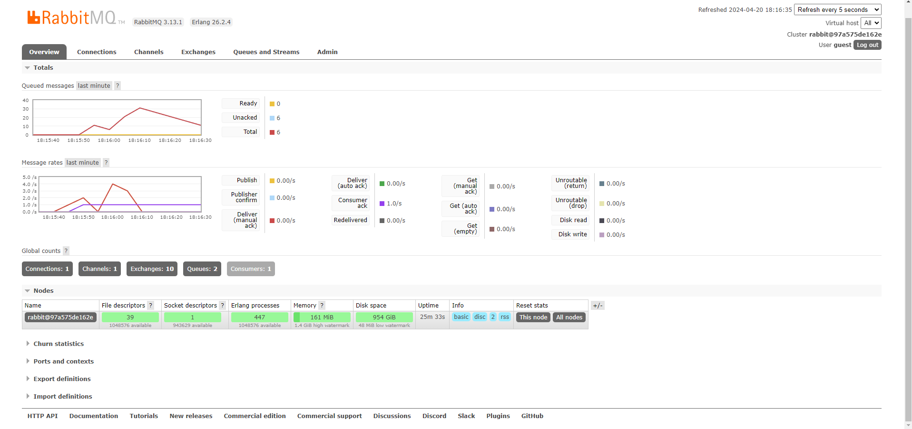

a. What is amqp?
- amqp (Advanded Message Queuing Protocol) is an open standard application layer protocol for message-oriented middleware, with a focus on queuing, routing, reliability and security.

b. What it means? guest:guest@localhost:5672 , what is the first quest, and what is the second guest, and what is localhost:5672 is for? 
- The string `guest:guest@localhost:5672` is a connection string for an AMQP server.
- `guest:guest` is the username and password for the server. In this case, both the username and password are "guest".
- `localhost` is the hostname of the server. In this case, the server is running on the same machine as the client.
- `5672` is the port number on which the server is listening. This is the default port for AMQP.

Screen capture ketika mensimulasikan subscriber yang lambat

